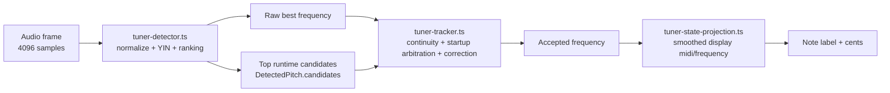

# Tuner Frequency Analysis

This folder explains how the tuner turns one audio frame into the note shown in the UI.

The implementation has three layers:

1. Frame-level pitch detection in `guitar-app/src/app/features/tuner/services/tuner-detector.ts`, with note/display helpers in adjacent tuner service modules.
2. Multi-frame acceptance, startup arbitration, and correction in `guitar-app/src/app/features/tuner/services/tuner-tracker.ts`, coordinated by `guitar-app/src/app/features/tuner/services/tuner.service.ts`.
3. UI note and cents display projected from the accepted tracking state in `guitar-app/src/app/features/tuner/services/tuner-state-projection.ts`.

Read in this order:

1. [detection-pipeline.md](./detection-pipeline.md)
2. [problems-and-solutions.md](./problems-and-solutions.md)
3. [glossary.md](./glossary.md)

## Mental model

`detectPitchFromSamples()` produces a best raw frequency plus a small ranked candidate list. `TunerService` decides whether to ignore that frame, keep the current lock, delay a startup decision, or switch to a better-supported candidate. The UI is driven by the accepted state after that service logic.

## Detector vs accepted pitch

- `rawFrequencyHz`: what the detector thinks is best for the current frame.
- `DetectedPitch.candidates`: alternate frame-level hypotheses the service can use for startup and correction.
- `frequencyHz` in `TunerState`: the accepted tracking result.
- `displayFrequencyHz` / `displayMidiFloat`: a UI-smoothed version of the accepted result.

This distinction matters because most of the interesting tuner behavior is not in YIN itself. It is in the policy layer that decides when a low candidate is a real note, a temporary subharmonic shadow, or a startup trap.

## Where to change behavior

- Change frame ranking or candidate generation in `guitar-app/src/app/features/tuner/services/tuner-detector.ts`.
- Change lock, startup, or correction policy in `guitar-app/src/app/features/tuner/services/tuner-tracker.ts`.
- Change UI-facing display smoothing or note projection in `guitar-app/src/app/features/tuner/services/tuner-state-projection.ts`.
- Check current expected behavior in:
  - `guitar-app/test/app/features/tuner/services/tuner-detector.spec.ts`
  - `guitar-app/test/app/features/tuner/services/tuner-note-math.spec.ts`
  - `guitar-app/test/app/features/tuner/services/tuner-tracking-candidates.spec.ts`
  - `guitar-app/test/app/features/tuner/services/tuner-tracker.spec.ts`
  - `guitar-app/test/app/features/tuner/services/tuner.service.spec.ts`
