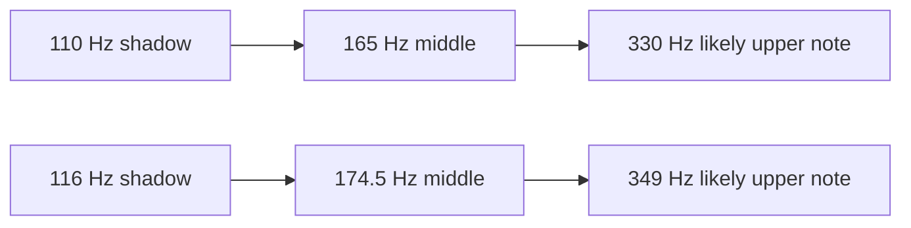

# Detection Pipeline

This file explains what one analysis frame goes through before the service decides whether to trust it.

## 1. Textbook YIN, in plain language

YIN looks for a repeating period in the waveform.

The intuition:

- Take the current signal.
- Compare it against delayed copies of itself.
- If the delay matches the real period, the two versions line up well, so the difference becomes small.
- Convert that lag into frequency with `frequency = sampleRate / lag`.

Conceptual sketch:

```text
signal:  /\    /\    /\    /\
        /  \  /  \  /  \  /  \

delay too short:
signal:  /\    /\    /\    /\
delay :   /\    /\    /\    /\
diff  :  large mismatch

delay near the true period:
signal:  /\    /\    /\    /\
delay :      /\    /\    /\    /\
diff  :  small mismatch
```

The steps in this implementation still follow that core shape:

1. Compute the YIN difference function.
2. Convert it into CMNDF so early lags are less unfairly favored.
3. Search for likely local minima.
4. Refine the chosen lag.
5. Convert lag to frequency.

CMNDF sketch:

```text
CMNDF
1.0 |\
0.8 | \
0.6 |  \      _        _
0.4 |   \_   / \__    / \
0.2 |     \_/     \__/   \__
0.0 +--------------------------------
        lag ->      ^      ^
                  candidate periods
```

Lower CMNDF minima imply stronger period matches.

## 2. What this implementation adds on top of plain YIN

The current detector is not "just YIN".

### Frame preprocessing

Before YIN runs, the detector:

- removes DC offset,
- applies a one-pole high-pass filter,
- applies light neighbor smoothing,
- applies a Hann window.

That work happens in `tuner-detector.ts` inside `normalizePitchFrame()`.

### Local minima, not just one threshold hit

The detector collects up to 10 local minima from the CMNDF curve with `collectTopLocalMinima()`. That matters because shadow cases often produce several plausible lags.

### Spectral peak candidates

The detector also scans a quarter-semitone grid for spectral peaks and keeps up to 8. That adds candidate frequencies which may not be the first YIN-style minimum but have better harmonic evidence.

### Harmonic candidate pool

`buildHarmonicCandidatePool()` merges:

- local minima,
- spectral peaks,
- the fallback YIN-selected lag if it was missing from the pool.

The pool is the detector's "maybe it is one of these" set.

### Candidate ranking

`scoreLagCandidate()` ranks the pool using:

- CMNDF quality,
- spectral support,
- small bonuses for the fallback or threshold lag,
- shadow-aware adjustments.

The shadow adjustments are the part that specifically tries to separate real fundamentals from octave or third-subharmonic traps.

### Runtime candidate export

The detector returns more than one answer:

- `frequencyHz`: the detector's current best frame-level answer.
- `candidates`: the top 4 ranked runtime candidates.

That exported candidate list is what enables service-side startup arbitration and post-lock correction.

## 3. Candidate ranking and shadow handling

The ranking code gives extra support to candidates that look like the top of a harmonic ladder and penalizes candidates that look like low shadows.

Key helpers:

- `hasThirdShadowSupport()`
- `hasHalfShadowSupport()`
- `hasUpperStringShadowLadderSupport()`
- `isLikelyThirdSubharmonicShadow()`
- `isLikelyUpperStringSubharmonicShadow()`

Conceptual shadow ladder:



This is the important idea: the detector is not blindly preferring high notes. It only gives extra credit when the whole ratio pattern looks like a known shadow ladder.

## 4. Detector terms

### `periodicity`

`1 - cmndfValue` at the selected lag. Higher means "this lag repeats more cleanly".

### `signalToNoiseEstimate`

An estimate derived by comparing signal energy against residual mismatch at the selected lag. Higher means "the delayed copy explains more of the frame".

### `probability`

A detector confidence score built from periodicity, RMS, SNR, and a small threshold-match bonus. It is used by the service, but it is not a guarantee that the chosen frequency is semantically correct.

### `rankingScore`

A per-candidate score used inside the candidate pool. This is for candidate ordering, not for UI display.

### `rms`

Frame energy after the detector's preprocessing step. This is not the raw microphone amplitude.

### Relative input level

Computed by `TunerTracker` from detector RMS against a rolling noise floor. This is the tracker-facing view of "how audible is this frame right now".

## 5. What "strong" means here

There is no single global definition of "strong".

### New-lock strong

For ordinary acquisition, a frame is strong enough to start a lock when it clears:

- probability `>= 0.60`
- periodicity `>= 0.72`
- SNR `>= 0`

That is `NEW_LOCK_MIN_*`.

### Held-lock strong

Once a note is already locked, the service is more tolerant:

- probability `>= 0.52`
- periodicity `>= 0.62`
- SNR `>= -8`

That is `HELD_LOCK_MIN_*`.

### Strong onset

A strong onset is an event, not just a threshold. `detectStrongOnset()` requires:

- signal already considered present,
- probability `>= 0.56`,
- periodicity `>= 0.70`,
- relative input level `>= 0.10`,
- and a fast enough rise, usually `>= 0.035`.

When that happens, the service opens a 3-frame onset window.

### Startup upper viability

For contested low-band startups, "strong enough to believe the upper candidate" depends on the ratio:

- third-shadow path: roughly `3x`, with upper ranking score `>= 0.52`, probability `>= 0.50`, periodicity `>= 0.68`, SNR `>= 1.5`
- octave path: roughly `2x`, with upper ranking score `>= 0.62`, probability `>= 0.34`, periodicity `>= 0.46`, SNR `>= -0.5`, and ranking lead `>= 0.08`

So "strong" is narrower for octave promotion than for third-shadow startup.

### Strong and very-strong subharmonic correction

Post-lock correction looks at streak averages, not just the last frame.

- strong correction average: probability `>= 0.57`, periodicity `>= 0.78`, SNR `>= 3`, level `>= 0.20`
- very strong correction average: probability `>= 0.62`, periodicity `>= 0.84`, SNR `>= 5`, level `>= 0.30`
- relaxed third-shadow very-strong path: probability `>= 0.60`, periodicity `>= 0.83`, SNR `>= 5`, level `>= 0.075`

That last relaxed path exists so a very convincing `110 -> 330` or `116 -> 349` correction can happen even when the later frames are softer.

## 6. Compact threshold reference

| Area | Constant(s) | Current value | What it controls |
| --- | --- | --- | --- |
| Detector band | `DETECTION_MIN_HZ`, `DETECTION_MAX_HZ` | `70`, `700` | Search range for the tuner detector |
| YIN threshold | `DEFAULT_YIN_THRESHOLD` | `0.12` | CMNDF threshold used by the YIN selection path |
| Local minima budget | `MAX_LOCAL_MINIMA_CANDIDATES` | `10` | How many CMNDF minima feed ranking |
| Spectral peak budget | `MAX_SPECTRAL_PEAK_CANDIDATES` | `8` | How many extra spectrum-derived candidates enter the pool |
| Runtime candidate export | `MAX_RUNTIME_RANKED_CANDIDATES` | `4` | How many ranked candidates are handed to the service |
| Detector has-pitch gate | inline in `detectPitchFromSamples()` | periodicity `>= 0.58`, probability `>= 0.46` | Minimum detector confidence before `hasPitch` becomes true |
| New lock | `NEW_LOCK_MIN_*` | prob `0.60`, per `0.72`, SNR `0` | Ordinary first-lock gate |
| Held lock | `HELD_LOCK_MIN_*` | prob `0.52`, per `0.62`, SNR `-8` | How weak a frame can be while preserving continuity |
| Acquire frames | `ACQUIRE_FRAMES` | `2` | Stable frames needed for normal startup lock |
| Lock hold | `LOCK_HOLD_FRAMES` | `9` | How long a lock keeps decaying before clearing |
| Lock clear | `CLEAR_LOCK_FRAMES` | `10` | Low-confidence frames before the accepted note is dropped |
| Strong onset | `STRONG_ONSET_*` | level `0.10`, rise `0.035`, window `3` | Faster handling for obvious fresh plucks |
| Soft upper-string path | `SOFT_UPPER_STRING_*` | min Hz `250`, streak `2`, prob `0.58`, per `0.80`, SNR `4.5` | Lets quiet high strings acquire without waiting for a generic `0.60` frame |
| Startup shadow band | `STARTUP_SHADOW_MIN_HZ`, `STARTUP_SHADOW_MAX_HZ` | `90` to `135` | Only low candidates in this band trigger contested-startup logic |
| Third-shadow startup ratio | `STARTUP_CONTESTED_RATIO_*` | target `3`, tol `0.16` | `110 -> 330` / `116 -> 349` style startup promotion |
| Octave startup ratio | `STARTUP_OCTAVE_RATIO_*` | target `2`, tol `0.12` | `99 -> 198` / `123 -> 248` style startup promotion |
| Startup upper confirm | `STARTUP_UPPER_CONFIRM_FRAMES` | `2` | Stable upper frames needed to prefer the upper startup hypothesis |
| Contested low confirm | `STARTUP_CONTESTED_LOW_CONFIRM_FRAMES`, `STARTUP_CONTESTED_STRONG_LOW_CONFIRM_FRAMES` | `4`, `3` | How long the service delays a suspicious low startup before accepting it |
| Pending correction grace | `PENDING_CORRECTION_GRACE_FRAMES` | `1` | One brief fallback frame can keep a correction streak alive |
| Subharmonic correction | `SUBHARMONIC_CORRECTION_*` | prob `0.57`, per `0.78`, SNR `3`, level `0.20`, confirm `4` | Main post-lock upward correction path |
| Very strong correction | `STRONG_SUBHARMONIC_CORRECTION_*` | prob `0.62`, per `0.84`, SNR `5`, level `0.30`, confirm `3` | Faster correction for very convincing evidence |
| Subharmonic shadow protection | `SUBHARMONIC_SHADOW_*` | prob `0.72`, per `0.84`, SNR `5.5`, level `0.12`, confirm `5` | Prevents easy collapse from a high lock down to a low shadow |

## 7. The split of responsibilities

- `tuner-detector.ts` answers: "What are the plausible frequencies in this frame?"
- `tuner-tracker.ts` answers: "Which of those should affect the user-visible note right now?"
- `tuner-state-projection.ts` answers: "How should the accepted pitch be smoothed and labeled for the UI?"

That split is deliberate. It keeps detector math local, keeps musical/interaction policy in the tracker, and keeps UI projection separate from both.
