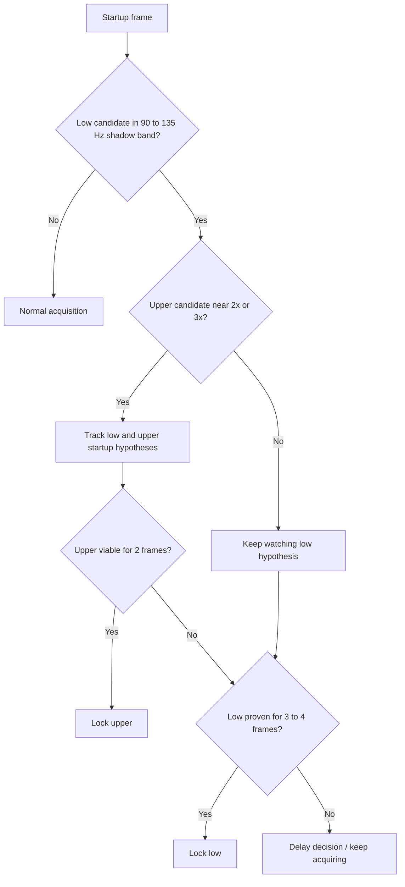

# Problems And Solutions

This file records the failure classes that shaped the current design. The policy is intentionally narrow: it tries to fix specific shadow modes without turning the tuner into a generic "prefer higher notes" system.

## Layered defense model

The current behavior is a stack of defenses:

1. Detector ranking heuristics try to keep obvious shadows from winning the frame.
2. Startup arbitration delays suspicious low-band locks and watches for a better upper candidate.
3. Post-lock correction can promote a locked low shadow if later frames strongly support the upper note.
4. Continuity and multi-frame evidence prevent one-frame flips in either direction.

Startup arbitration flow:

## 1. Plain YIN or early-lag bias picks low shadows

- Symptom: a low subharmonic candidate wins even though a higher candidate better matches the musical note.
- Root cause: YIN naturally rewards low lags that repeat well, and CMNDF alone does not understand harmonic ladders.
- Chosen solution: collect multiple local minima, add spectral peak candidates, build a shared candidate pool, and rank it with shadow-aware adjustments.
- Why the policy is intentionally narrow: the ranking helpers only add or subtract weight when nearby 2x or 3x relationships also have supporting spectral evidence.
- Known tradeoff: the detector still emits low candidates in hard cases; it is not trying to "solve" every ambiguity alone.

## 2. `E4` startup locks at about `110 Hz` instead of about `330 Hz`

- Symptom: a fresh high-E pluck can appear first as a convincing `110 Hz` shadow.
- Root cause: the attack can produce a `110 -> 165 -> 330` ladder where the low lag is stable before the service has any history.
- Chosen solution: startup arbitration treats a `90..135 Hz` low candidate as contested when a viable `~3x` upper candidate appears; after 2 stable upper frames it locks the upper note.
- Why the policy is intentionally narrow: the special handling only triggers in the low startup band and only when the upper candidate clears explicit ranking, probability, periodicity, and SNR gates.
- Known tradeoff: contested startup can delay the first visible lock by a frame or two.

## 3. `F4` startup locks at about `116 Hz` instead of about `349 Hz`

- Symptom: `F4` can exhibit the same bad first lock pattern as `E4`, just shifted to about `116 -> 349 Hz`.
- Root cause: this is the same third-subharmonic ladder problem, not a note-specific bug.
- Chosen solution: the same contested-startup `~3x` path handles both `110 -> 330` and `116 -> 349` style cases.
- Why the policy is intentionally narrow: the code does not hard-code note names; it checks low-band membership plus a ratio profile.
- Known tradeoff: if the upper candidate is intermittent, the service waits rather than immediately trusting either side.

## 4. Octave-shadow cases like `123 -> 248 Hz` and `99 -> 198 Hz`

- Symptom: some startups are not third shadows; they are octave shadows where the musically correct note is about `2x` the low candidate.
- Root cause: a lower octave-like period can be easier to detect early in the attack than the intended upper note.
- Chosen solution: contested startup also supports an octave profile, but with stricter ranking-lead requirements because octave promotion is easier to overfire.
- Why the policy is intentionally narrow: the octave path requires ratio closeness to `2x` plus a stronger ranking lead than the third-shadow path.
- Known tradeoff: octave corrections are intentionally conservative and may wait longer than third-shadow cases.

## 5. Real low notes like `A2` must not be promoted

- Symptom: a real `A2` at about `110 Hz` can have upper harmonics, but those harmonics must not trick the system into inventing a false `220` or `330` startup winner.
- Root cause: any anti-shadow heuristic can over-promote if it treats "higher exists" as sufficient evidence.
- Chosen solution: startup promotion requires a viable upper runtime candidate with enough ranking, probability, periodicity, and SNR. A plain harmonic above a real `A2` usually does not clear those gates.
- Why the policy is intentionally narrow: `A2` still acquires quickly through the normal 2-frame path when there is no viable upper partner.
- Known tradeoff: the system prefers a missed promotion over a false promotion in this region.

## 6. Bad first lock needs a different policy from post-lock correction

- Symptom: sometimes the detector makes a bad first lock low, but later frames make the true upper note obvious.
- Root cause: startup has no accepted-note history, while post-lock tracking does. Those are different decision contexts.
- Chosen solution: the service keeps startup arbitration separate from post-lock correction. After lock, it accumulates a pending correction streak and promotes only after multi-frame averages become strong enough.
- Why the policy is intentionally narrow: correction only applies to known low-band shadow relationships, uses compatibility windows, and allows only one brief grace miss.
- Known tradeoff: a wrong first lock can remain visible briefly before the service has enough evidence to repair it.

## 7. Quiet but valid upper-string onsets should still lock

- Symptom: soft high-string plucks can be real notes even when they do not immediately clear the general new-lock thresholds.
- Root cause: high strings can have solid pitch structure with lower absolute level, especially near the noise floor.
- Chosen solution: the service tracks `upperStringCandidateFrames` and enables a softer acquisition path for repeated upper-string evidence above `250 Hz`.
- Why the policy is intentionally narrow: it requires a short streak plus still-respectable probability, periodicity, and SNR thresholds, and it only applies in the upper range.
- Known tradeoff: the meter and signal logic may light up slightly earlier for quiet high strings than for other notes.

## Why this is not "prefer higher notes"

The current policy is narrower than that:

- Only startup lows in `90..135 Hz` are automatically treated as suspicious.
- Upward promotion is tied to ratio profiles near `2x` or `3x`.
- The upper candidate must be viable on its own.
- Real low fundamentals like `A2` are expected to pass unchanged.
- Downward moves from a locked high note are also guarded by a stricter shadow-confirmation path.

That is why the E4/F4 fix should be understood as an anti-shadow policy, not as a bias toward treble notes.
